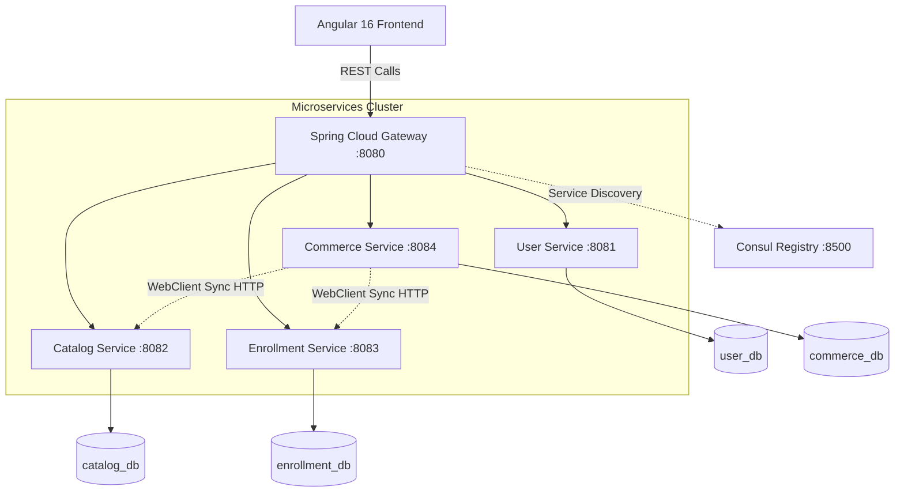

<h1 align="center">🛒 CourseCart</h1>

<p align="center">
  
  
  
  
  
</p>

<p align="center">
  <strong>A modern, full-stack microservices application for a la carte online learning.</strong><br/>
  MASTER IMPLEMENTATION (Fully Implemented)
</p>

---

## 🎯 About This Project

This is the **MASTER IMPLEMENTATION** of the CourseCart system. It is a fully functional, enterprise-grade microservices application designed to showcase modern development practices, featuring strict service isolation and resilient inter-service communication.

All features are fully implemented, and there are no trainee assignments or stubs in this version.

---

## 📋 Features

### 👤 Customer Portal

| Feature | Details |
| --- | --- |
| **Registration** | Register with Full Name, Username, and Password. Usernames must be unique. Default role: `USER`. |
| **Login / Logout** | Login with username and password. Session stored securely in `localStorage`. Logout clears session. |
| **Course Browsing** | Browse active courses; filter by category (e.g., Software Engineering, Data Science); search by course title. True backend pagination. |
| **Course Details** | View full course details: title, description, category, price, and syllabus. Displays context-aware "Buy Now" or "Continue Learning". |
| **Mock Checkout** | Unified checkout workspace. Simulates payment process. Creates Commerce order and triggers Enrollment service creation synchronously. Duplicate purchase strictly prevented. |
| **My Learning** | Dashboard listing all enrolled courses. Displays overall progress percentage per course. |
| **Lesson Progress** | Access course content and mark individual lessons as complete. Real-time progress updates. |
| **Order History** | View past successful purchases including course title, date, and amount paid. |
| **View Profile** | View read-only profile detailing Name, Username, and Role. |

### 🛡️ Administrator Portal

| Feature | Details |
| --- | --- |
| **Admin Dashboard** | High-level platform metrics: total learners, active courses, total enrollments, total revenue. Tabular view of recent orders with Order ID. |
| **Manage Courses** | Add, edit, draft, publish, and unpublish courses. Assign categories and fixed pricing. |
| **Manage Lessons** | Add, edit, and delete text-based lesson content for a specific course. Cascading completion handling. |
| **Manage Categories** | Create and edit categories. Attempting to delete a category with active courses attached is gracefully blocked. |

---

## 🏗 System Architecture

The application uses a **Microservices Architecture** with four independently deployable business services. Each service maintains its own isolated MySQL database, preventing cross-domain joins.

- **Spring Cloud Gateway** (`:8080`) — single entry point; handles routing and CORS.
- **Spring Cloud Consul** (`:8500`) — service discovery and health monitoring.
- **WebClient & Resilience4j** — asynchronous HTTP calls equipped with circuit breakers to prevent cascading failures.



---

## 💻 Tech Stack

### Backend

- **Java 21** & **Spring Boot 3.2.x** (Spring Cloud)
- **Spring Data JPA** & **Hibernate**
- **Spring Cloud Gateway** & **Spring Cloud Consul**
- **WebClient** (Inter-service communication)
- **Resilience4j** (Circuit Breaker)
- **MySQL** (Four Independent Databases)

### Frontend

- **Angular 16.2.x** & **TypeScript**
- **RxJS**
- **Bootstrap 5** (responsive UI via CDN)
- **Route Guards** (`AuthGuard`, `AdminGuard`) for role-based page protection

---

## 🛠 Getting Started

### Prerequisites

- **JDK 21** installed and on `PATH`
- **Node.js v18+** and **Angular CLI** installed globally
- **MySQL** running on default port `3306`
- **HashiCorp Consul** running on default port `8500`

### Setup & Run

**1. Start Consul:**

```bash
consul agent -dev
```

**2. Initialize Databases:**
Execute the following schema and seed scripts to initialize the 4 isolated microservice databases.

```bash
mysql -u root -p < backend/user-service/src/main/resources/user_db.sql
mysql -u root -p < backend/catalog-service/src/main/resources/catalog_db.sql
mysql -u root -p < backend/commerce-service/src/main/resources/commerce_db.sql
mysql -u root -p < backend/enrollment-service/src/main/resources/enrollment_db.sql
```

**3. Start Microservices** (run each in a separate terminal via `mvn spring-boot:run`):

```bash
cd backend/api-gateway           && mvn spring-boot:run
cd backend/user-service          && mvn spring-boot:run
cd backend/catalog-service       && mvn spring-boot:run
cd backend/enrollment-service    && mvn spring-boot:run
cd backend/commerce-service      && mvn spring-boot:run
```

**4. Launch Frontend:**

```bash
cd frontend/coursecart-ui
npm install
npm start
```

Open `http://localhost:4200`

---

## 🗄 Default Seed Data

### Login Credentials

| Role     | User ID | Username | Password |
| -------- | ------- | -------- | -------- |
| Admin    | `1001`  | `admin` | `password` |
| Customer | `1002`  | `rahul_s`    | `password` |
| Customer | `1003`  | `priya_p`    | `password` |
| Customer | `1004`  | `amit_s`     | `password` |
| Customer | `1005`  | `pooja_v`    | `password` |
| Customer | `1006`  | `rohan_g`    | `password` |

### Seeded Records

| Module   | Count | Details                                                                                                  |
| -------- | ----- | -------------------------------------------------------------------------------------------------------- |
| Users    | 6     | 1 Admin, 5 Customers                                                                                     |
| Categories| 5     | Software Engineering, Cloud Computing, Data Science, Artificial Intelligence, Web Development |
| Courses  | 80    | Distributed across categories, varying from Free to paid. Richly populated with draft/active status.     |
| Lessons  | 75    | Distributed across various courses containing text-based learning material.                                  |
| Enrollments| 19    | Verified historical enrollments distributed among customers.                                             |
| Orders   | 19    | Completed purchase records for paid courses.                                                         |

---

## 🔒 API Design & Security

This project uses **Frontend-Managed Identity and Access Control**:

**Authentication:**

- Login through User Service.
- User credentials are validated against stored credentials.
- User information is stored in `localStorage`.
- `AuthGuard`/`AdminGuard` control frontend navigation.

**Backend Identity:**

- `userId` is explicitly supplied through request body/path/query.
- The backend does **not** receive `X-User-Id` or `X-User-Role` headers.

**Authorization:**

- Frontend route guards provide UI-level role restrictions.
- The backend does **not** provide centralized authentication or authorization.
- Microservices use YAML (`application.yml`) to enforce strict isolation constraints instead of properties files.

---

<p align="center">
  <em>By Jagmohan Kushwaha</em>
</p>
